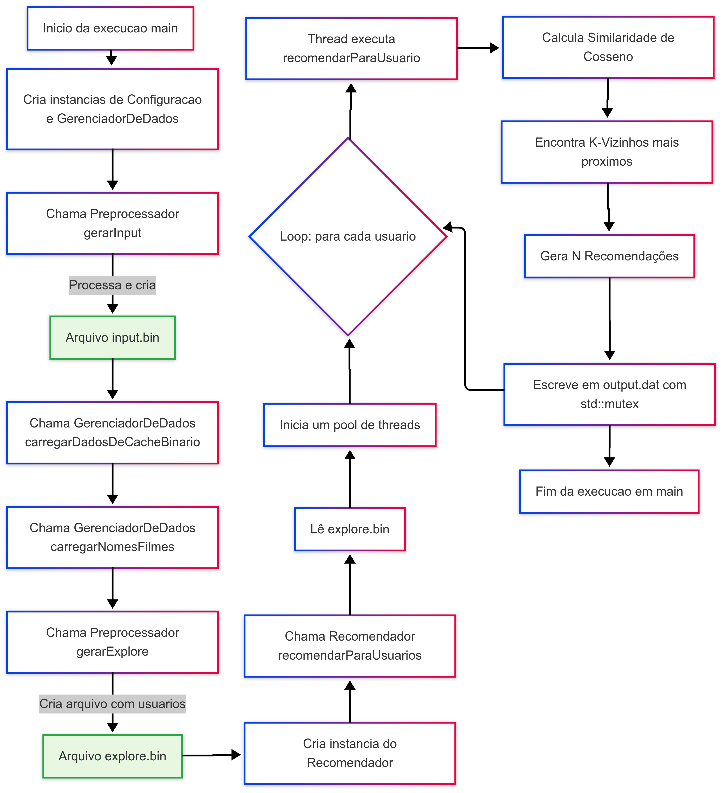
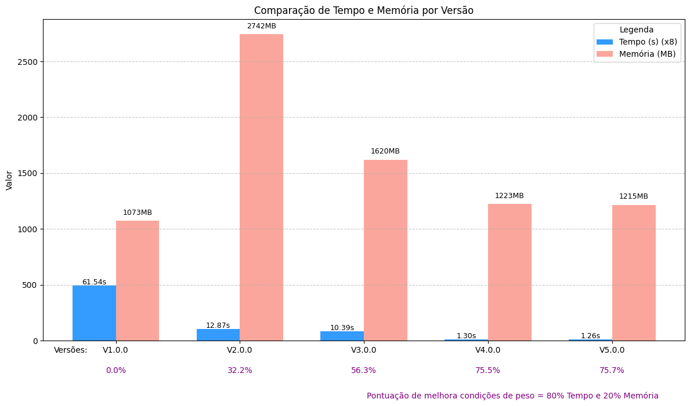
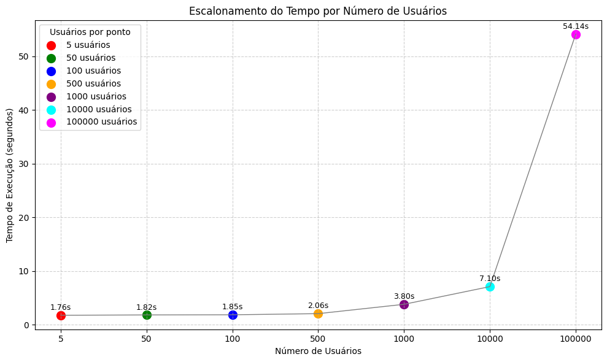

<h1 style="text-align: center; font-size: 30px;">📽️ SISTEMA DE RECOMENDAÇÃO 📽️</h1>

---

- **Alunos:** Kairo Henrique, Tauane Luísa, Igor Moreira, Maria Eduarda, Heitor Henrique.
- **Professor:** Michel Pires da Silva  
- **Disciplina:** Algoritmos e Estruturas de Dados I  

---

## **Introdução**

Este projeto consiste no desenvolvimento de um sistema de recomendação capaz
de sugerir agrupamentos de elementos similares a partir de perfis de usuários e
características de itens. O trabalho foi desenvolvido como parte da disciplina de
Algoritmos e Estruturas de Dados I, no Centro Federal de Educação Tecnológica
de Minas Gerais (CEFET-MG)

---

## **Problema Proposto**

O objetivo principal deste trabalho é desenvolver um sistema de recomendação
que, a partir de perfis de usuários e características de itens (filmes, neste caso),
seja capaz de sugerir agrupamentos de elementos similares. O sistema deve ser
capaz de calcular medidas de similaridade para identificar afinidades entre usuários e
itens, gerando recomendações personalizadas.

---

## **Funcionalidades**

O sistema de recomendação implementa as seguintes funcionalidades:

- **Pré-processamento de Dados**: Realiza a limpeza e organização dos dados
brutos da base <a href ="https://www.kaggle.com/datasets/garymk/movielens-25m-dataset">MovieLens 25M</a>. Isso inclui a filtragem de usuários com
poucas avaliações, filmes com poucas avaliações, remoção de duplicatas
e a geração de um arquivo de entrada padronizado (input.bin) para
otimização do carregamento
- **Carregamento e Gerenciamento de Dados**: Eficientemente carrega e
gerencia os dados de usuários, filmes e suas avaliações a partir de arquivos
binários, otimizando o acesso para o processo de recomendação.
- **Cálculo de Similaridade**: Calcula a similaridade entre usuários utilizando
a métrica de similaridade de cosseno. Isso permite identificar usuários
com gostos e padrões de avaliação semelhantes.
- **Geração de Recomendações**: Com base nos usuários mais similares, o
sistema identifica filmes que o usuário-alvo ainda não avaliou, mas que
foram bem avaliados pelos seus vizinhos mais próximos. As
recomendações são então geradas e salvas em um arquivo de saída
(output.dat).
- **Suporte a Múltiplas Threads**: O processo de recomendação é otimizado
para utilizar múltiplas threads, aproveitando o hardware disponível para
acelerar o cálculo de similaridade e a geração de recomendações.
---

## **Requisitos Técnicos**

Para compilar e executar o sistema de recomendação, são necessários os
seguintes requisitos:

- **Sistema Operacional**: Debian GNU/Linux 12.7 (ou compatível).
- **Compilador**: g++ versão 13 ou superior.
- **Linguagens**: C e C++.
- **Bibliotecas**: Exclusivo uso da biblioteca padrão da linguagem C++.
- **Base de Dados**: <a href ="https://www.kaggle.com/datasets/garymk/movielens-25m-dataset">MovieLens 25M</a> (especificamente o arquivo ratings.csv e
movies.csv).

---

## **Estrutura de Dados e Metodologia**

Segue a seguir um fluxograma representando o funcionamento da estrutura do programa

<details> 
  <summary><strong>Fluxograma</strong></summary>


</details> 

--- 
### O sistema é modularizado e organizado em classes, cada uma com responsabilidades bem definidas:

- **Configuracao.hpp/.cpp**: Gerencia os parâmetros de configuração do
sistema, como o número de vizinhos (K_VIZINHOS), o número de
recomendações a serem geradas (N_RECOMENDACOES) e o número de
usuários a serem explorados (N_USUARIOS_EXPLORAR).
- **Filme.hpp/.cpp**: Representa um filme, armazenando seu ID e,
potencialmente, outras informações relevantes.
- **Usuario.hpp/.cpp**: Representa um usuário, contendo seu ID e um vetor de
pares (ID do filme, nota) para suas avaliações. Também armazena a
magnitude do vetor de avaliações para otimização do cálculo de
similaridade.
- **Preprocessador.hpp/.cpp**: Responsável pelo pré-processamento dos
dados. Lê o arquivo ratings.csv, filtra usuários e filmes conforme os critérios
definidos (mínimo de 50 avaliações para usuários e filmes), remove
duplicatas e gera arquivos binários (input.bin e explore.bin) para
carregamento eficiente dos dados.
- **GerenciadorDeDados.hpp/.cpp**: Encarregado de carregar e gerenciar os
dados de usuários e filmes. Carrega os dados pré-processados de input.bin
e os nomes dos filmes de movies.csv, disponibilizando-os para o restante
do sistema.
- **CalculadorDeSimilaridade.hpp/.cpp**: Implementa o algoritmo para
calcular a similaridade entre dois usuários. A métrica utilizada é asimilaridade de cosseno, que mede o ângulo entre os vetores de avaliação
dos usuários. A implementação é otimizada para eficiência.
- **Recomendador.hpp/.cpp**: O coração do sistema de recomendação. Para
cada usuário no arquivo explore.bin, ele busca os K_VIZINHOS mais
similares utilizando o CalculadorDeSimilaridade. Em seguida, identifica
filmes bem avaliados por esses vizinhos que o usuário-alvo ainda não viu e
gera as N_RECOMENDACOES finais, salvando-as no arquivo output.dat. O
processo de recomendação é paralelizado usando múltiplas threads para
melhorar a performance.
- **main.cpp**: Orquestra o fluxo principal do programa, chamando as funções
de pré-processamento, carregamento de dados e o processo de
recomendação. Também mede e exibe os tempos de execução de cada
etapa.


---

## **Otimizações**

### Otimização de Entrada:

Para processar o massivo arquivo `ratings.csv`, o sistema utiliza duas etapas otimizadas, atacando os dois principais gargalos do processo: a leitura do disco (I/O) e o processamento do texto (CPU).

#### **Passo 1: Leitura Massiva do Disco (Otimização de I/O)**
A primeira otimização foca em transferir os dados do disco para a memória RAM da forma mais rápida possível. Em vez de ler o arquivo linha por linha (o que exigiria milhares de chamadas de sistema), é utilizada a técnica de **Leitura em Bloco Único**:
1. O tamanho total do arquivo é medido.
2. Um buffer de memória (`std::string`) do tamanho exato é pré-alocado.
3. O conteúdo inteiro do arquivo é lido do disco para este buffer com **uma única e massiva operação `read()`**.

* **O Ganho**: Minimiza a comunicação com o sistema operacional e o disco, que são operações inerentemente lentas.

#### **Passo 2: Parsing em Memória (Otimização de CPU)**
Uma vez que os gigabytes de texto estão na RAM, o desafio é convertê-los para números sem criar novos gargalos. É aqui que entra o **Parsing de Alta Performance**:
* **`std::string_view`**: Em vez de criar uma `std::string` para cada linha e cada campo (o que geraria milhões de alocações de memória), `string_view` é usado para criar "visões" ou "ponteiros" leves sobre o buffer original. Isso permite analisar o texto **sem fazer nenhuma cópia**.
* **`std::from_chars`**: Para a conversão de texto para número, esta é a rotina mais rápida do C++ padrão, superando com folga alternativas como `stoi` ou `stringstream` por não ter a sobrecarga de alocação de memória ou tratamento de exceções.

* **O Ganho Total**: Ao combinar as duas técnicas, o processo de ter os dados do `.csv` disponíveis como números na memória é ordens de magnitude mais rápido do que uma abordagem ingênua.

---
### Cálculo de Similaridade com Vetores Ordenados

* **A Estratégia**: Para calcular a similaridade de cosseno, é preciso encontrar os filmes que dois usuários avaliaram em comum. Uma busca ingênua seria muito lenta (quadrática). A otimização consiste em ordenar a lista de avaliações de cada usuário por ID de filme e depois usar um algoritmo de "merge" para encontrar os filmes em comum.

* **A Implementação**: O código real desta função já é o exemplo perfeito (fornecido anteriormente). O `while` com dois ponteiros (`i` e `j`) que avançam simultaneamente é a materialização desta estratégia.

* **O Ganho**: Transforma uma operação de complexidade O(N*M) em O(N+M), onde N e M são os números de avaliações dos dois usuários. Para usuários com muitas avaliações, a diferença é gigantesca.

---

### Seleção de "Top K" com `std::partial_sort`

* **A Estratégia**: Durante a recomendação, precisamos encontrar os "K vizinhos mais similares" e as "N melhores recomendações". Ordenar a lista inteira de vizinhos ou de filmes candidatos para depois pegar os primeiros é um desperdício. `std::partial_sort` resolve isso.

* **A Implementação (Pseudo-código)**:
    <details>
      <summary><strong>Clique para ver o pseudo-código</strong></summary>

    ```cpp
    // Dentro da função de recomendação...

    // Exemplo: Encontrar os K vizinhos mais similares
    std::vector<pair<int, float>> similares; // Vetor com MILHARES de similaridades calculadas.
    int k_count = std::min(K_VIZINHOS, (int)similares.size());

    // Esta função REARRANJA o vetor de forma que os 'k_count' maiores elementos
    // fiquem nas primeiras posições. O resto do vetor fica em ordem indefinida.
    std::partial_sort(
        similares.begin(),
        similares.begin() + k_count, // Onde a parte ordenada termina.
        similares.end(),
        [](const auto& a, const auto& b) { return a.second > b.second; } // Ordenar do maior para o menor.
    );

    // Agora, os K melhores estão convenientemente nas primeiras posições,
    // sem o custo de ordenar o vetor inteiro.
    ```
    </details>

* **O Ganho**: `std::partial_sort` tem complexidade aproximadamente linear (O(N)), enquanto um `std::sort` completo tem complexidade O(N log N). Em vetores grandes, a economia de tempo é substancial.

---

### Distribuição de Trabalho com `std::atomic`

* **A Estratégia**: Em um sistema multi-thread, é preciso distribuir o trabalho (neste caso, os usuários para os quais se deve gerar recomendações) entre as threads. Usar um `mutex` para que cada thread pegue um novo usuário da lista funciona, mas pode gerar contenção. Uma abordagem mais moderna e de maior performance é usar uma variável atômica.

* **A Implementação (Pseudo-código)**:
    <details>
      <summary><strong>Clique para ver o pseudo-código</strong></summary>
    
    ```cpp
    // Dentro da função que orquestra as threads...

    // Um único índice atômico, compartilhado por todas as threads.
    std::atomic<size_t> next_index(0);
    std::vector<int> usuariosParaProcessar = ...;

    // Lógica que cada thread executa em loop:
    while (true) {
        // fetch_add incrementa a variável e retorna o valor ANTERIOR.
        // Esta operação é atômica (indivisível) e geralmente lock-free.
        size_t idx = next_index.fetch_add(1, std::memory_order_relaxed);

        // Se o índice que a thread pegou já passou do fim da lista, não há mais trabalho.
        if (idx >= usuariosParaProcessar.size()) {
            break; 
        }

        // Se não, a thread é responsável por processar este usuário.
        recomendarParaUsuario(usuariosParaProcessar[idx], ...);
    }
    ```
    </details>

* **O Ganho**: `std::atomic` permite que as threads peguem seu próximo item de trabalho sem pausas (locks), evitando gargalos de contenção e permitindo que as threads passem quase 100% do tempo executando o trabalho útil, o que melhora a escalabilidade com o número de cores do processador.

---

### **Otimizações de Compilação (Flags)**

O `Makefile` do projeto está configurado para instruir o compilador `g++` a realizar otimizações agressivas, transformando o código C++ em um código de máquina altamente eficiente.

* **`-O3`**: É o nível de otimização mais agressivo. Ele habilita um vasto conjunto de técnicas, como *loop unrolling* (desenrolamento de laços), *inlining* de funções e reordenação de instruções para melhor aproveitar o pipeline do processador.

* **`-march=native`**: Esta flag é crucial para performance. Ela instrui o compilador a gerar código otimizado especificamente para a arquitetura da CPU da máquina onde a compilação está ocorrendo. Isso permite o uso de conjuntos de instruções mais modernos e rápidos (como **AVX** e **FMA**), que não seriam usados em um binário genérico e podem acelerar massivamente os cálculos de ponto flutuante.

* **`-flto` (Link-Time Optimization)**: Uma otimização poderosa que ocorre na fase final de linkagem. Ela permite que o compilador analise e otimize o programa **como um todo**, enxergando as interações entre todos os diferentes arquivos de código-fonte, em vez de otimizar cada um isoladamente. Isso possibilita otimizações mais profundas.

* **`-ffast-math`**: Relaxa algumas regras estritas de precisão de ponto flutuante do padrão IEEE 754. Isso dá ao compilador a liberdade de fazer otimizações matemáticas mais agressivas, como reassociar operações, o que é especialmente útil em laços computacionais intensos como os do cálculo de similaridade.

---

### Grafico comparativo entre as versões do codigo:
<details> 
  <summary><strong>Grafico de custo e tempo medio entre as versões</strong></summary>
 
 - **Testes realizados com 5 usuarios e 10 recomendações e os resultados sao a media de 10 execucoes**
 - **Escala de tempo esta (x8) para melhor visualizaçao**




</details> 

Neste grafico foi apresentado custo e tempo medio entre as versões senda cada uma delas com essas implementações de otimizaçao:


---
#### Versão 1.0.0:

<p>Esta Versão base sem nenhuma otimizacao, apenas funcionamento do codigo<br>
<strong>Tempo medio: 61.5377 segundos e Memoria maxima: 1073.41 MB</p></strong>

---

#### Versão 2.0.0:

<p>Esta versão ja com otimizacao, foi a com maiores ganhos onde colocamos leituras de arquivos em c puro com finalidade de acelerar a leitura e escrita dos arquivos, modularizasão do codigo, utilização de threads do processador e flags do makefile para otimização <br>
<strong>Tempo medio: 12.8664 segundos e Memoria maxima: 2742.44 MB</p></strong>

---

#### Versão 3.0.0:

<p>Esta versão, foi utilizado `Cálculo de Similaridade com Vetores Ordenados` e `Seleção de "Top K" com (std::partial_sort)`, nesta versão tambem estava implementado o `Memory Pool` que foi descontinuado nas futuras versões<br>
<strong>Tempo medio: 10.3921 segundos e Memoria maxima: 1620.12 MB</p></strong>

---

#### Versão 4.0.0:

<p>Esta versão colocamos `Otimização de Entrada`, `Distribuição de Trabalho com `std::atomic``, arquivos sairam de .dat para .bin para melhorar o tempo e custo de memoria e tambem onde foram efetuados testes com CUDA (utiliza GPU) que foi descontinuado pela complexidade, falta de portabalidade e piora de tempo<br>
<strong>Tempo medio: 1.2982 segundos e Memoria maxima: 1222.74 MB</p></strong>

---

#### Versão 5.0.0:

<p>Versão atual do nosso programa onde ela foi feita apenas melhorias e "limpeza" dos codigos, retirando funcões, classes e bibliotecas que nao estavam mais sendo utilizadas e tambem foi realizado melhora na estrutura do codigo como nos comentarios e na intedentação do codigo para melhor entendimento geral e melhor organização<br>
<strong>Tempo: 1.2641 segundos e Memoria maxima: 1215.30 MB</p></strong>


---

## **Fluxo de Execução**
1. **Pré-processamento**: O Preprocessador lê ratings.csv e movies.csv, filtra os
dados e gera input.bin (dados de usuários e avaliações) e explore.bin
(usuários para os quais gerar recomendações).
2. **Carregamento de Dados**: O GerenciadorDeDados carrega input.bin e
movies.csv para a memória.
3. **Recomendação**: O Recomendador itera sobre os usuários em explore.bin.
- Para cada usuário, o CalculadorDeSimilaridade é usado para
encontrar os K_VIZINHOS mais similares.
- Filmes não avaliados pelo usuário-alvo, mas bem avaliados pelos
vizinhos, são identificados.
- As N_RECOMENDACOES são geradas e escritas em output.dat.
4. **Otimização**: O sistema utiliza std::ios_base::sync_with_stdio(false) e
std::cin.tie(NULL) para otimização de I/O, e paralelização com std::thread
para acelerar o processo de recomendação.

---

## **Ambiente de Teste**
O projeto foi desenvolvido e testado no seguinte ambiente:
- **Sistema Operacional**: Linux Debian GNU 12
- **Hardware**: Processador Ryzen 7 5700x - 32GB de Memoria - SSD NVME
- **Compilador**: g++ 13 ou superior.
- **Linguagens**: C e C++.
- **Base de Dados**: <a href ="https://www.kaggle.com/datasets/garymk/movielens-25m-dataset">MovieLens 25M</a> Ratings e Movies (disponível no Kaggle).

## **Organização do Repositório**

```

Sistema-de-recomendacao/  
├── src/ # Código fonte do projeto  
│ ├── CalculadorDeSimilaridade.cpp  
│ ├── Configuracao.cpp  
│ ├── Filme.cpp  
│ ├── GerenciadorDeDados.cpp  
│ ├── main.cpp  
│ ├── Preprocessador.cpp  
│ ├── Recomendador.cpp  
│ └── Usuario.cpp  
├── include/ # Arquivos de cabeçalho (.hpp)  
│ ├── CalculadorDeSimilaridade.hpp  
│ ├── Configuracao.hpp  
│ ├── Filme.hpp  
│ ├── GerenciadorDeDados.hpp  
│ ├── Preprocessador.hpp  
│ ├── Recomendador.hpp  
│ └── Usuario.hpp  
├── dados/ # Diretório para os arquivos de entrada (ratings.csv, movies.csv)  
├── resultados/ # Diretório para os arquivos de saída (output.dat)    
├── Makefile # Arquivo para compilação e execução do projeto  
├── README.md # Este arquivo README
├── .assets/ # Arquivos de imagem para este arquivo README
└── TrabalhoFinal.pdf # Documento com a especificação do trabalho

```
---

# **Bibliotecas Utilizadas**

Este projeto foi construído utilizando exclusivamente recursos da **Biblioteca Padrão do C++**. Nenhuma biblioteca de terceiros foi necessária. 
Abaixo estão as principais bibliotecas utilizadas e suas finalidades no projeto:

### **Manipulação de Dados e Contêineres**
* **`<vector>`**: A principal estrutura de dados do projeto. Armazena a lista de avaliações (pares de ID do filme e nota) para cada usuário.
* **`<string>`** e **`<string_view>`**: Utilizadas para toda a manipulação de texto. `std::string` armazena dados que precisam de posse (como nomes de arquivos), enquanto `std::string_view` é uma otimização crucial usada para visualizar e processar "fatias" de strings sem criar cópias, sendo fundamental no parsing de alta performance dos arquivos CSV.
* **`<unordered_map>`**: Estrutura de hash de alta performance, essencial para mapear os IDs de usuários e filmes aos seus objetos e dados correspondentes. Garante acesso em tempo médio constante O(1).
* **`<unordered_set>`**: Usado para validações rápidas, como verificar os filmes que um usuário já assistiu ou filtrar usuários e filmes válidos durante o pré-processamento.
* **`<utility>`**: Fornece o `std::pair`, utilizado para agrupar o ID de um filme e a nota dada pelo usuário em um único elemento dentro do vetor de avaliações.
* **`<charconv>`**: (C++17) Acesso à função `std::from_chars`, uma forma moderna e extremamente rápida de converter sequências de caracteres para tipos numéricos, usada para otimizar o parsing do arquivo `ratings.csv`.

### **Algoritmos e Funções Matemáticas**
* **`<algorithm>`**: Fornece algoritmos essenciais e otimizados, como `std::sort`, `std::partial_sort` (para encontrar os K vizinhos e N recomendações de forma eficiente) e `std::shuffle`.
* **`<cmath>`**: Utilizada para a função `std::sqrt`, necessária para calcular a magnitude (norma euclidiana) do vetor de avaliações de cada usuário.
* **`<random>`**: Usada para gerar aleatoriedade de boa qualidade (`std::random_device`, `std::mt19937`) para o `std::shuffle`.

### **Entrada/Saída (I/O)**
* **`<iostream>`**: Para operações de entrada e saída no console (`std::cout`, `std::cerr`).
* **`<fstream>`**: Essencial para a manipulação de arquivos (leitura de `.csv` e leitura/escrita de `.bin`).


### **Programação Concorrente e Paralelismo**
* **`<thread>`**: A base do paralelismo no projeto, usada para criar e gerenciar as threads que dividem o trabalho.
* **`<mutex>`**: Garante a segurança na escrita concorrente no arquivo `output.dat` com `std::lock_guard`.
* **`<future>`**: Utilizada com `std::async` para gerenciar de forma assíncrona o pré-processamento dos dados.
* **`<atomic>`**: Fornece `std::atomic` para controlar o índice do próximo usuário a ser processado pelas threads de forma segura e sem a necessidade de um `mutex`.


### **Medição de Tempo**
* **`<chrono>`**: Usada para medir com alta precisão o tempo de execução do sistema.


---


# **Resultados**

## Exemplo de saida do output

```

45024 123:Chungking Express (Chung Hing sam lam) (1994) 1411:Hamlet (1996) 860:Maybe, Maybe Not (Bewegte Mann, Der) (1994)

```

Este Output foi gerado utilizando os seguintes valores N_RECOMENDACOES = 3 e N_USUARIOS_EXPLORAR = 1 
```
formato do output:'ID Usuário' 'ID Filme':'Nome Filme'
```


---

## **Análise de Escalonamento do Tempo de Execução**

Este gráfico mostra o comportamento do tempo de execução do programa de acordo com o número de usuários.
<details> 
  <summary><strong>Grafico de escalonamento do tempo de acordo com o número de usuários</strong></summary>



</details>

### Principais Observações

- **De 5 para 1.000 usuários**  
  O tempo aumentou de **1.76s para 3.80s**, um crescimento de **+116%**, mesmo com um aumento de **+19.900%** na quantidade de usuários indicando **alta eficiência no início**.

- **De 1.000 para 10.000 usuários**  
  O tempo subiu de **3.80s para 7.10s**, um crescimento de **+86.8%**, o que ainda representa um **bom escalonamento**.

- **De 10.000 para 100.000 usuários**  
  O tempo passou de **7.10s para 54.14s**, um crescimento de **+662%**, indicando que a **performance começa a degradar em grandes volumes** possivelmente por limitações de paralelismo, uso de disco ou consumo de memória.


## Implementações Descartadas

Durante o desenvolvimento, algumas técnicas de otimização avançada foram exploradas. No entanto, elas foram descartadas por não apresentarem um ganho de desempenho significativo que justificasse o aumento na complexidade do código ou por introduzirem novos gargalos. As principais foram:

### **Memory Pool**
* **A Ideia**: Substituir o alocador de memória padrão do C++ por um *memory pool*. A teoria era que, ao alocar um grande bloco de memória de uma só vez e gerenciá-lo manualmente para os objetos `Usuario` e suas avaliações, poderíamos reduzir a sobrecarga de múltiplas chamadas ao sistema operacional e melhorar a localidade de cache.
* **Motivo do Descarte**: O padrão de alocação deste projeto consiste em poucas e grandes alocações no início da execução para carregar os dados. Os alocadores padrão das bibliotecas C++ modernas (como o `glibc malloc`) já são extremamente eficientes para este cenário. Nos testes, o ganho de performance com o *memory pool* foi **irrisorio e inconsistente**, não justificando a complexidade de implementar, depurar e manter um gerenciador de memória customizado.

### **Computação em GPU com CUDA**
* **A Ideia**: Portar o cálculo da similaridade de cosseno, que é a parte mais intensiva do ponto de vista computacional, para ser executado em paralelo na GPU utilizando a plataforma CUDA da NVIDIA.
* **Motivo do Descarte**: Embora a GPU seja massivamente mais rápida para cálculos de produto escalar, o principal gargalo do sistema não é apenas a computação, mas também a **transferência de dados**. Para cada usuário sendo processado, seria necessário copiar os vetores de avaliação de milhares de outros usuários da memória RAM para a memória VRAM. O tempo gasto nessa transferência de dados **superou o ganho obtido com o processamento acelerado**. O resultado final foi um desempenho inferior à abordagem multi-thread na CPU, que opera diretamente nos dados já carregados na RAM. Além disso, a implementação adicionaria uma forte dependência do ecossistema NVIDIA, reduzindo a portabilidade do projeto e dificuldade em testes, além disso vimos que ela so seria superior com uma quantitade muito maior de dados

---

## **Melhorias Futuras**
Possíveis melhorias e funcionalidades a serem implementadas no futuro incluem:
- Implementação de Outras Métricas de Similaridade: Adicionar suporte para
outras métricas de similaridade, como Distância Euclidiana ou
Similaridade de Jaccard, permitindo a comparação de desempenho entre
elas.
- Otimização de Memória: Explorar estruturas de dados mais eficientes ou
técnicas de compressão para reduzir o consumo de memória,
especialmente para bases de dados maiores.
- Interface de Usuário: Desenvolver uma interface gráfica (GUI) ou uma
interface de linha de comando mais interativa para facilitar a interação com
o sistema.
- Persistência de Recomendações: Implementar um mecanismo para
persistir as recomendações geradas em um banco de dados ou outro
formato, permitindo o acesso posterior sem a necessidade de reexecutar o
processo completo.
- Recomendações Baseadas em Itens: Adicionar um módulo de
recomendação baseado em itens, que sugere filmes similares aos que o
usuário já gostou, em vez de apenas basear-se em usuários similares.
- Atualização Dinâmica da Base de Dados: Permitir que a base de dados de
avaliações seja atualizada dinamicamente, sem a necessidade de um préprocessamento completo a cada nova avaliação.
- Avaliação de Recomendações: Implementar métricas de avaliação de
recomendação (precisão, recall, F1-score) para quantificar a
qualidade das sugestões geradas.

---
 
# **Conclusão**


*********************falar sobre analise assintotica e concluir
